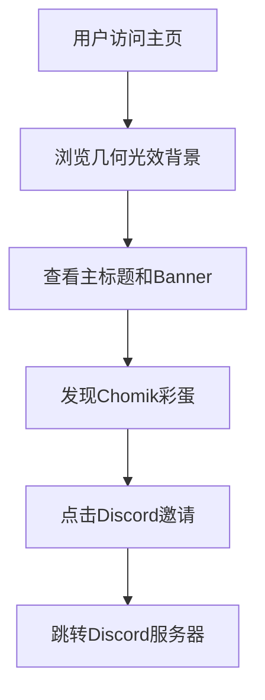

## 1. 产品概述
Twilight State官方导航站是一个具有几何光效渲染风格的单页面网站，展示AIGC美学设计，主要作为Discord服务器的入口页面。
目标用户为对AIGC和几何光效设计感兴趣的社区成员，通过视觉冲击力的设计吸引用户加入Discord社群。

## 2. 核心功能

### 2.1 用户角色
本导航站无需用户注册，所有访客均可访问。

### 2.2 功能模块
Twilight State导航站包含以下核心页面：
1. **主页**：几何光效展示区、主标题、Discord邀请按钮、Chomik彩蛋元素。

### 2.3 页面详情
| 页面名称 | 模块名称 | 功能描述 |
|---------|---------|---------|
| 主页 | 几何光效背景 | 展示丁达尔光效（God rays），包含半透明三角形、重叠圆形等几何元素，营造大气散射效果 |
| 主页 | 主标题区域 | 显示"TWILIGHT STATE"大标题，采用无衬线字体，深棕色配色，居中布局 |
| 主页 | Banner图片 | 展示用户提供的横幅图片 `native-image (2) (1).png`，作为视觉焦点 |
| 主页 | Discord邀请 | 提供Discord服务器邀请链接 `https://discord.gg/5n8cprqpC2`，点击跳转 |
| 主页 | Chomik彩蛋 | 隐藏豚鼠元素，鼠标悬停或点击时触发互动效果 |

## 3. 核心流程
用户访问网站流程：
1. 用户进入主页，首先看到几何光效背景和主标题
2. 浏览Banner图片和整体视觉效果
3. 发现隐藏的Chomik彩蛋并互动
4. 点击Discord邀请按钮加入社群

## 4. 用户界面设计

### 4.1 设计风格
- **主色调**：暖色日落渐变（琥珀色、橙色、赭色、深栗色）
- **辅助色**：深棕色/近黑色用于文字
- **按钮样式**：几何形状按钮，带有光晕效果
- **字体**：无衬线字体，大写标题，宽字距
- **图标风格**：几何线条图标，配合光效使用

### 4.2 页面设计概述
| 页面名称 | 模块名称 | UI元素 |
|---------|---------|---------|
| 主页 | 几何光效背景 | 全屏渐变背景，从左上浅色过渡到右下深色，包含半透明几何形状和丁达尔光效 |
| 主页 | 主标题 | 中央大标题"TWILIGHT STATE"，深棕色，大写字母，宽字距，轻微阴影效果 |
| 主页 | Banner图片 | 居中显示，带有柔和发光边框，与背景光效融合 |
| 主页 | Discord按钮 | 几何形状按钮，带有悬停光效，包含Discord图标 |
| 主页 | Chomik彩蛋 | 小型豚鼠图标，半透明隐藏状态，悬停时显现并轻微动画 |

### 4.3 响应式设计
采用桌面优先设计，适配大屏幕显示几何光效细节，移动端保持核心视觉元素和功能性。

### 4.4 3D场景指导
- **环境**：暖色调日落HDRI，营造黄昏氛围
- **光照**：主光源从左上方向右下方投射，产生丁达尔光效，强度0.8，暖色温
- **相机**：固定视角，FOV 60度，轻微仰视角度突出几何元素
- **构图**：前景几何形状，中景主标题，背景渐变天空
- **交互**：鼠标移动产生视差效果，悬停元素产生光晕增强
- **后处理**：轻微辉光效果，色调映射保持暖色调