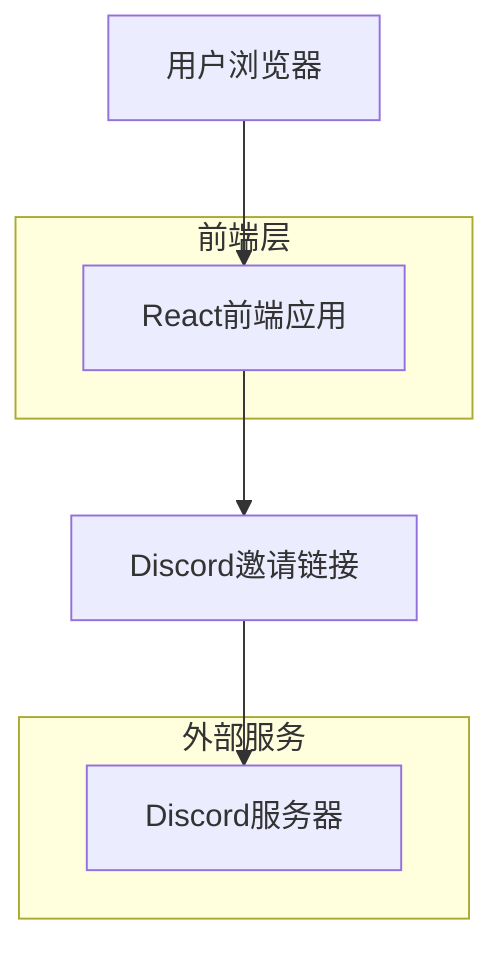

## 1. 架构设计



## 2. 技术栈描述

- **前端**: React@18 + TailwindCSS@3 + Vite
- **初始化工具**: vite-init
- **后端**: 无（纯前端静态站点）
- **3D渲染**: Three.js + @react-three/fiber + @react-three/drei
- **动画库**: Framer Motion
- **图标**: Lucide React

## 3. 路由定义

| 路由 | 用途 |
|------|------|
| / | 主页，展示几何光效和Discord邀请 |

## 4. 组件架构

### 4.1 核心组件
- **HeroSection**: 主视觉区域，包含几何光效和标题
- **DiscordInvite**: Discord邀请按钮组件
- **ChomikEasterEgg**: 豚鼠彩蛋组件
- **GeometricBackground**: 几何背景光效组件

### 4.2 3D场景组件
- **GodRays**: 丁达尔光效组件
- **GeometricShapes**: 几何形状渲染组件
- **VolumetricLight**: 体积光效果组件

## 5. 依赖管理

### 5.1 核心依赖
```json
{
  "dependencies": {
    "react": "^18.2.0",
    "react-dom": "^18.2.0",
    "three": "^0.158.0",
    "@react-three/fiber": "^8.15.0",
    "@react-three/drei": "^9.88.0",
    "framer-motion": "^10.16.0",
    "lucide-react": "^0.294.0"
  },
  "devDependencies": {
    "@types/react": "^18.2.0",
    "@types/react-dom": "^18.2.0",
    "@types/three": "^0.158.0",
    "tailwindcss": "^3.3.0",
    "vite": "^5.0.0"
  }
}
```

## 6. 性能优化

### 6.1 3D渲染优化
- 使用InstancedMesh渲染重复几何形状
- 启用WebGL抗锯齿
- 限制最大FPS为60
- 使用LOD（细节层次）优化远处元素

### 6.2 资源优化
- 图片资源使用WebP格式
- 实施懒加载策略
- 使用CSS-in-JS避免样式冲突
- 启用Vite的代码分割

## 7. 部署配置

### 7.1 构建配置
```javascript
// vite.config.js
export default {
  build: {
    target: 'es2015',
    minify: 'terser',
    rollupOptions: {
      output: {
        manualChunks: {
          'react-vendor': ['react', 'react-dom'],
          'three-vendor': ['three', '@react-three/fiber', '@react-three/drei'],
          'motion-vendor': ['framer-motion']
        }
      }
    }
  }
}
```

### 7.2 静态托管
- 支持Vercel、Netlify等静态托管平台
- 配置SPA路由回退到index.html
- 启用Gzip压缩和CDN缓存